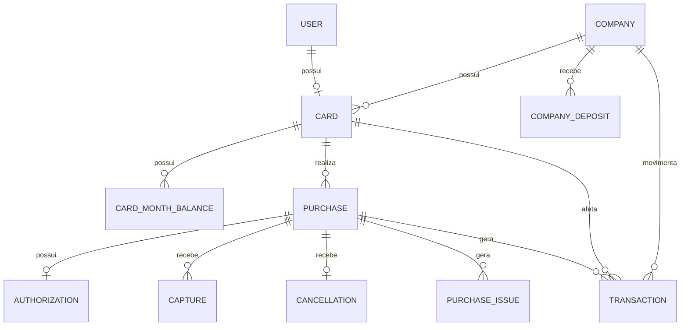

# MODEL.md

## 1. O modelo

`Company` existe para representar o saldo financeiro da empresa e o valor atualmente reservado por autorizações abertas.

`Card` representa o cartão do funcionário e concentra regras próprias como limite mensal, limite por compra, status e MCCs bloqueados.

`CardMonthBalance` mantém a projeção do limite restante de cada cartão por mês, evitando recalcular todo o histórico a cada autorização.

`Purchase` é o agregado que reúne uma autorização e todos os fatos posteriores relacionados a ela: capturas, cancelamento, issues e transações.

`Authorization` preserva a mensagem original de autorização e a decisão tomada quando ela foi processada pela primeira vez.

`Capture` preserva cada captura recebida da rede, inclusive capturas parciais e eventos recebidos fora de ordem.

`Cancellation` registra o fato de que o restante ainda não capturado não deve mais permanecer reservado.

`PurchaseIssue` registra fatos válidos que exigem atenção operacional, sem impedir o processamento financeiro.

`Transaction` é o ledger das movimentações que alteram limite do cartão, saldo da empresa ou reserva da empresa.

`CompanyDeposit` representa entrada de dinheiro na empresa e é a única operação financeira de escrita permitida pelo painel administrativo.

Os valores monetários são armazenados em centavos inteiros. IDs internos usam `BIGINT`; IDs recebidos da rede são preservados em campos próprios e usados na idempotência.

## 2. Decisões

### D1. Representação dos fatos e do estado

Decidi preservar autorização, captura e cancelamento em tabelas próprias e usar `Purchase` como agregado. O estado atual fica projetado na compra, empresa e saldo mensal, enquanto `Transaction` preserva os movimentos financeiros.

### D2. Reserva é uma Transaction?

Sim. Uma autorização aprovada altera o limite restante do cartão e o disponível da empresa, portanto gera `authorization_hold`, mesmo sem reduzir ainda o saldo da empresa.

### D3. Captura acima do esperado

A captura é aceita e o estado financeiro é atualizado. Para MCCs `5812`, `7011` e `7512`, até 120% é esperado; acima disso, ou acima de 100% nos demais MCCs, é criado `overcapture_exceeded`. Rejeitar a captura foi descartado porque ela representa uma cobrança que já ocorreu.

### D4. Estado financeiro

Usei `company_available = balance - reserved` e `card_available = min(monthly_remaining, company_available)`, com piso zero para o disponível. Cartão bloqueado sempre retorna disponível zero, embora o limite restante armazenado possa ser diferente.

### D5. O que é issue

Evento fora de ordem não é issue, porque o contrato permite isso. Issues existem para `overcapture_exceeded`, `capture_after_cancellation` e `capture_for_declined_authorization`; eventos ainda sem autorização ficam apenas pendentes.

### D6. Evento antes da autorização

Capture ou cancellation recebido antes da autorização é persistido em uma `Purchase` com status `pending_authorization`, sem efeito financeiro imediato. Quando a autorização chega, ela é decidida normalmente e os eventos pendentes são reconciliados.

### D7. Mês da compra

O mês pertence à autorização. Converto o `occurred_at` UTC da autorização para `America/Sao_Paulo` e salvo `YYYY-MM` na compra; capturas e cancelamentos posteriores continuam pertencendo a esse mesmo mês.

### D8. Projeção ou recálculo

Escolhi manter projeções para saldo, reserva e limite mensal e, ao mesmo tempo, registrar todas as alterações em `Transaction`. Recalcular tudo a cada consulta foi descartado porque tornaria a autorização mais cara e mais difícil de proteger contra concorrência.

### D9. IDs internos

Usei `BIGINT` padrão para IDs internos e mantive os IDs externos da rede em campos separados. ULID foi considerado, mas descartado porque não adicionava vantagem relevante para um único banco PostgreSQL neste escopo.

### D10. Retry e reemissão

O ID externo é a principal chave de idempotência. Capturas também têm unicidade natural por compra e sequência, e existe no máximo um cancelamento por compra. Não usei fingerprint completo para autorizações com IDs diferentes porque duas compras legítimas podem ter os mesmos dados.

## 3. Riscos e garantias

| Risco                                                | Garantia no código                                                                                | Teste                                                       |
| ---------------------------------------------------- | ------------------------------------------------------------------------------------------------- | ----------------------------------------------------------- |
| Processar duas vezes a mesma autorização             | IDs externos únicos, consulta de autorização existente e tratamento de conflito de unicidade      | testes de idempotência de autorização                       |
| Duas requisições alterarem saldo simultaneamente     | `DB::transaction()` e `lockForUpdate()` em compra, empresa e saldo mensal                         | testes de autorização e cenários publicados                 |
| Evento chegar antes da autorização                   | `Purchase` pendente armazena capture/cancellation e reconcilia depois                             | testes de eventos fora de ordem                             |
| Capture de autorização recusada quebrar o estado     | captura é aceita, cria saldo mensal se necessário e registra `capture_for_declined_authorization` | `DeclinedAuthorizationCaptureTest` e `CaptureEdgeCasesTest` |
| Capture após cancellation recriar reserva            | reserva permanece zero e é registrado `capture_after_cancellation`                                | testes de capture/cancellation                              |
| Capture chegar depois de um `final=true`             | `has_final_capture` mantém reserva zero e status `settled`                                        | `CaptureEdgeCasesTest`                                      |
| Cancellation sem reserva gerar movimento inexistente | cancellation é armazenado, mas `Transaction` só nasce se havia reserva para liberar               | `CancellationEdgeCasesTest`                                 |
| Campos extras de cancellation causarem 422           | regras específicas de capture só são aplicadas quando `type=capture`                              | `EventValidationTest`                                       |
| Extrato mudar timestamps ou ordem                    | `Transaction` preserva `occurred_at`, referência e deltas; ordenação é por `occurred_at` e ID     | testes de statement                                         |
| Funcionário visualizar dados de outro cartão         | `/my-card` sempre busca o cartão pelo usuário autenticado                                         | `MyCardTest`                                                |
| Usuário comum acessar administração                  | `User::canAccessPanel()` libera apenas Marina                                                     | `AdminAccessTest`                                           |
| Alteração administrativa indevida                    | resources financeiros são somente leitura; depósito é a única rota `create`                       | `CompanyDepositTest` e teste de acesso administrativo       |

## 4. O que eu esperava dos cenários

### P2

Estado inicial relevante: Ana possui limite mensal de R$ 2.000,00 e a empresa possui R$ 10.000,00 de saldo.

Após a autorização de R$ 800,00:

`Ana remaining = 1.200,00`  
`Company balance = 10.000,00`  
`Company reserved = 800,00`  
`Company available = 9.200,00`

A autorização apenas cria reserva; ainda não há saída de dinheiro.

Após o capture de R$ 300,00, sequência 1:

`Ana remaining = 1.200,00`  
`Company balance = 9.700,00`  
`Company reserved = 500,00`  
`Company available = 9.200,00`

R$ 300,00 saíram do saldo e R$ 300,00 deixaram de estar reservados, portanto o disponível da empresa continua igual.

Após o segundo capture de R$ 300,00:

`Ana remaining = 1.200,00`  
`Company balance = 9.400,00`  
`Company reserved = 200,00`  
`Company available = 9.200,00`

Após o capture final de R$ 260,00:

`captured = 860,00`  
`Ana remaining = 1.140,00`  
`Company balance = 9.140,00`  
`Company reserved = 0,00`  
`Company available = 9.140,00`

Como o MCC é `7011`, o esperado pode chegar a 120% de R$ 800,00, ou R$ 960,00. Portanto R$ 860,00 não gera issue.

Depois de executar o cenário, o resultado bateu com a expectativa e nenhuma decisão precisou ser alterada.

### P3

Estado inicial relevante: Bruno possui limite mensal de R$ 500,00.

Após a autorização de R$ 400,00:

`Bruno remaining = 100,00`  
`Company balance = 10.000,00`  
`Company reserved = 400,00`  
`Company available = 9.600,00`

Após o capture final de R$ 480,00:

`Bruno remaining = 20,00`  
`Company balance = 9.520,00`  
`Company reserved = 0,00`  
`Company available = 9.520,00`

O capture usa R$ 80,00 além do valor que já estava reservado, então o limite restante cai de R$ 100,00 para R$ 20,00. Como R$ 480,00 é exatamente 120% de R$ 400,00 para MCC `5812`, não há issue.

Na autorização seguinte de R$ 50,00, espero `monthly_limit_exceeded`, porque Bruno possui apenas R$ 20,00 restantes. Nenhum saldo deve mudar.

Na autorização seguinte de R$ 20,00, espero aprovação porque igualdade ao limite é permitida:

`Bruno remaining = 0,00`  
`Company balance = 9.520,00`  
`Company reserved = 20,00`  
`Company available = 9.500,00`

Como Diego possui limite mensal muito maior que o saldo da empresa, seu disponível também deve ser R$ 9.500,00.

Depois de executar o cenário, os valores e decisões bateram com a expectativa.

## 5. O que mudou e o que foi descartado

O primeiro desenho considerava ULID para os IDs internos. Troquei por `BIGINT`, porque não havia necessidade de geração distribuída de IDs e o modelo ficou mais simples.

Considerei reconstruir todo o estado somente a partir dos eventos, próximo de event sourcing. Descartei porque aumentaria a complexidade das autorizações e das consultas; mantive fatos + ledger + projeções.

Considerei recalcular saldo e limite a partir do histórico em toda consulta. Descartei para manter decisões de autorização rápidas e permitir bloqueios de linha sobre um estado projetado.

A ideia inicial de tratar evento antes da autorização como issue foi descartada. O enunciado deixa claro que a ordem é arbitrária, então esses eventos passaram a ser apenas pendentes.

Considerei rejeitar overcapture. Descartei porque capture representa um fato financeiro já ocorrido; o sistema registra o valor integral e sinaliza a inconsistência.

Considerei deduplicar autorizações com IDs diferentes usando fingerprint do conteúdo. Descartei porque duas compras legítimas podem coincidir em cartão, valor, estabelecimento e horário.

Durante a implementação, encontrei dois casos de borda que exigiram ajuste: capture de autorização recusada antes da criação do saldo mensal e evento posterior a um capture final. O primeiro passou a criar a projeção mensal quando necessária; o segundo passou a preservar `settled` e reserva zero.

Também ajustei cancellation sem reserva: o fato continua sendo armazenado, mas não é criada `Transaction`, já que nenhuma grandeza financeira mudou.

Também considerei abstrações mais amplas, como ULID e uma separação maior de componentes. Mantive apenas o que trazia ganho concreto para o domínio e descartei o que aumentava a complexidade sem melhorar as garantias exigidas pelo desafio.
